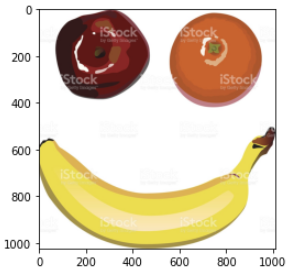
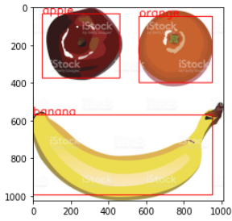

# Fruit_Detection_on_faster_rcnn (link on dataset https://www.kaggle.com/mbkinaci/fruit-images-for-object-detection/download)
This is my project on detection with neural networks at the MIPT DLS. 
This is my first project in the field of deep learning.
I did all the work on Google Colab
if you have any questions for me, you can write to me in telegram - @npocTo_naBeJI.
A little later, I'll upload the best weights I found for this task.

Example:

